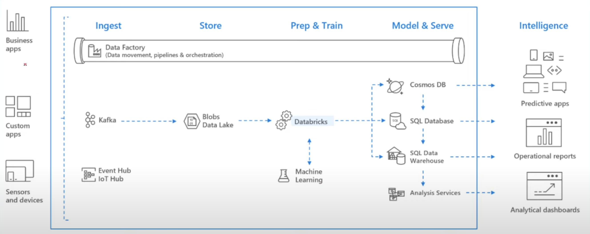

# Azure Databricks(ADB)  
It is designed to simplify the process of building and managing big data and artificial intelligence (AI) solutions. Azure Databricks integrates Apache Spark, a fast and general-purpose distributed computing system, into the Azure platform.  

So in short words **Azure Databricks** is used to process the huge data nothing but big data which means trasform the file.csv data to database or some where which is in meaningful format.  

  

## Server less  
ADB is a serverless  

## Basic concepts and tasks  
### Notebooks  
Notebooks are interactive documents that contain both code (in languages like Python, Scala, SQL, etc.) and rich-text elements. Notebooks are used for data exploration, analysis, and visualization. Users can create, edit, and execute code within notebooks.  

### Clusters  
Clusters are virtual machines that provide the computing resources for running notebooks and jobs. You can create and configure clusters based on your workload requirements. Clusters can be auto-scaled to adapt to changing workloads.  

### Workspace  
An Azure Databricks workpace is an environment for accessing all your Azure Databricks Assets.  

The Workspace organizes below objects into Folders.  
• Notebooks  
• Libraries  
• Experiments  

### Jobs  
Jobs is mechanism for running code in Azure Databricks  

### Libraries  
A library makes third-party or locally-built code available to notebooks and jobs running on your clusters.  

### Data   
You can import data into a distributed file system mounted into an Azure Databricks workspace and work with it in Azure Databricks notebooks and clusters. You can also use a wide variety of Apache Spark data sources to access data. 

### Experiments  
MLflow Experiments lets you run MLflow machine learning model trainings  

### Folders
Folders contain all static assets within a workspace: notebooks, libraries, experiments, and other folders. Click a folder name to open or close the folder and view its contents. To perform any action on Folder Click down arrow.  
#### Special Folders  
• An Azure Databricks workspace has three special folders: Workspace, Shared, and Users. You cannot rename or move a special folder.  
• The Workspace root folder is a container for all your organization's Azure Databricks static assets  
• Shared is for sharing objects across your organization. All users have full permissions for all objects in Shared.  
• Users contains a folder for each user. We will call it as Users Home Folder. Objects in this folder are by default Private to that user.  
• Workspace ID can be found in URL  

## Verifications  
1. Verify clusters  
2. Verify notebooks  
3. Verify ADB  
